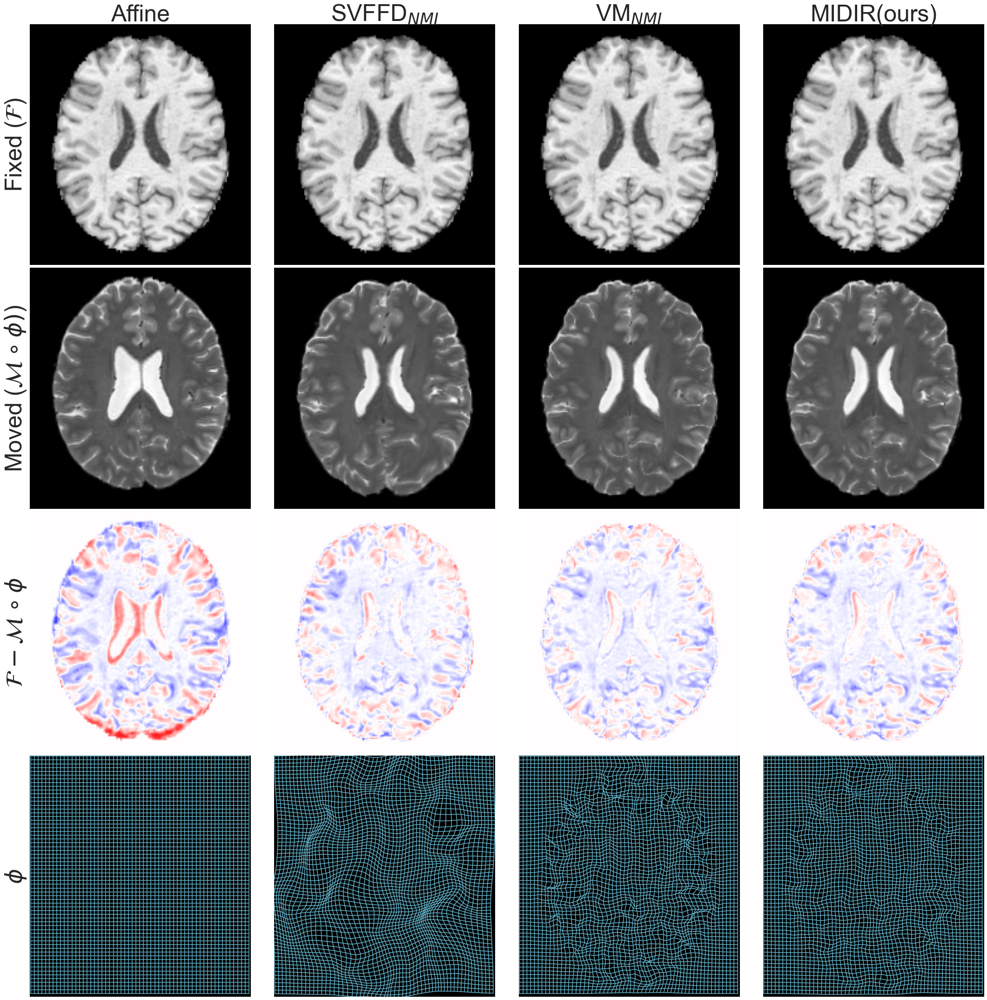

# Learning Diffeomorphic and Modality-invariant Registration using B-splines

This repository contains code for the Modality-Invariant Diffeomorphic Deep Learning Image Registration (MIDIR) framework 
presented in the paper:

> Paper

Please consider citing the paper if you use the code in this repository.




## Installation
1. Clone this repository
2. In a fresh Python 3.7.x virtual environment, install dependencies via:
    ```
    pip install -r /[path_to_cloned_repository]/requirements.txt
    ```

### Using GPU
If you want to run the code on GPU (which is recommended), you should check your CUDA and CuDNN installations. 
This code has been tested on CUDA 10.1 and CuDNN 7.6.5. 
Later versions should be backward-competible. 

To install the exact CUDA and CuDNN versions with the corresponding Pytorch build:
```
pip install torch==1.5.1+cu101 torchvision==0.6.1+cu101 -f https://download.pytorch.org/whl/torch_stable.html
```

## Structure
- `conf`: Hydra configuration for training deep learning models
- `conf_inference`: Hydra configuration for inference
- `data`:  data loading
- `model`
    - `lightning.py`: the LightningModule which puts everything together
    - `loss.py`: image similarity loss and transformation regularity loss
    - `network.py`: dense and b-spline model networks
    - `transformation.py`: dense and b-spline parameterised SVF transformation modules
    - `utils.py`
- `utils`: some handy utlitiy functions


## Training


## Inference/Testing


## Data format